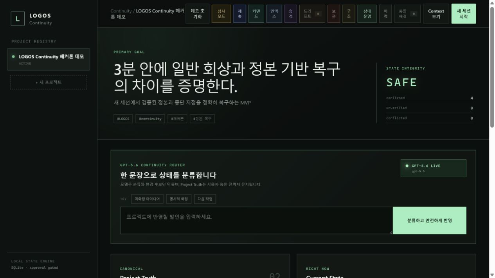
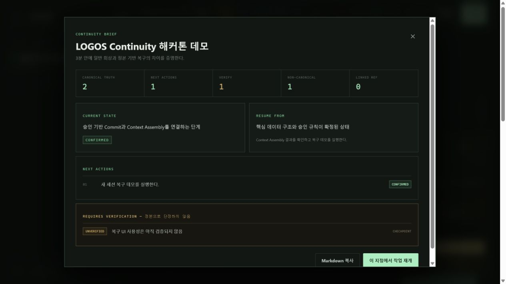
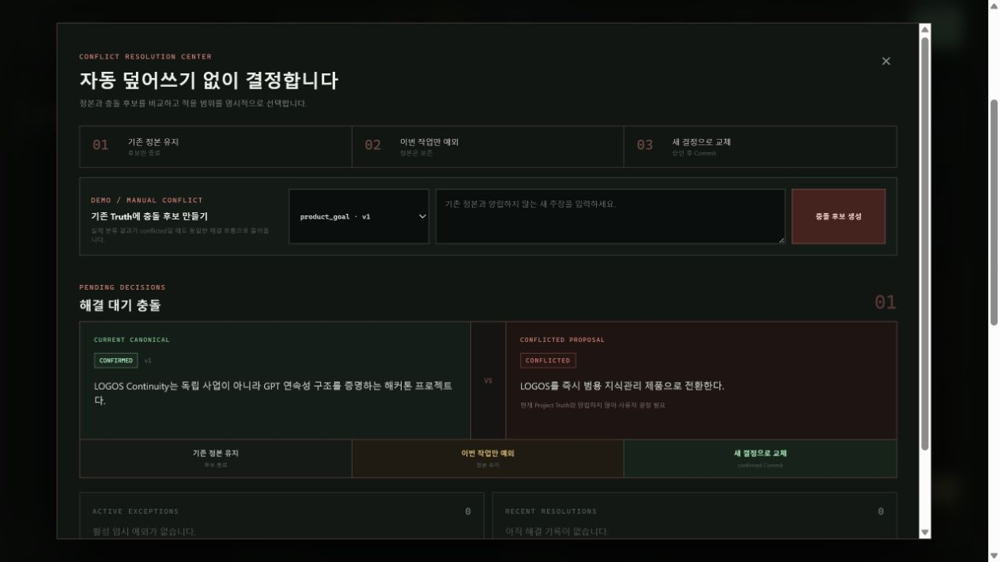

# LOGOS Continuity

**Approval-gated, provenance-aware continuity for long-running AI work.**

[Live Judge Demo](https://logos-continuity-judge.onrender.com/) · [Build Week Evidence](docs/BUILD_WEEK_BUILD_LOG.md) · [Demo Guide](docs/JUDGE_DEMO_SCRIPT.md)

LOGOS Continuity helps people resume complex AI-assisted work without allowing uncertain memories to silently become facts. It identifies the right project in a new session, restores verified state and interruption context, and requires explicit approval before canonical project truth changes.

## OpenAI Build Week

- **Track:** Work and Productivity
- **Built with:** Codex and GPT-5.6
- **Runtime GPT-5.6 role:** project recognition and structured statement classification
- **Codex role:** architecture, implementation, testing, browser QA, deployment, and submission tooling
- **Free judge access:** <https://logos-continuity-judge.onrender.com/>

## The Problem

Long-running AI work often spans multiple conversations. Ordinary conversational recall can mix:

- past and current state;
- confirmed decisions and speculative ideas;
- completed work and unverified claims;
- canonical project facts and temporary exceptions.

That ambiguity creates a serious productivity risk: a new session can confidently resume from the wrong state.

## The Solution

LOGOS Continuity maintains an explicit continuity layer with separate authority and verification boundaries:

- **Project Truth:** canonical, approved project facts;
- **Current State:** what is true right now;
- **Next Actions:** confirmed executable work;
- **Exploration:** ideas and hypotheses that are not canonical;
- **Active Checkpoint:** temporary interruption-recovery context;
- **History and Provenance:** what changed, why, and where it came from;
- **Conflict Resolution:** explicit human choice instead of silent overwrite.

GPT-5.6 proposes recognition and classification results. It never bypasses the local approval rules that protect canonical state.

## Three-Minute Judge Path

1. Open the [live demo](https://logos-continuity-judge.onrender.com/).
2. Click **데모 초기화** (`Reset Demo`).
3. Confirm the **GPT-5.6 LIVE** badge.
4. Click **심사 모드** (`Judge Mode`).
5. Follow the seven guided steps from Command Center to Assembled Context.

The guided route is designed for a `02:50` demonstration and includes safe sample inputs, proof points, and direct links to each operational center.

## Screenshots

### GPT-5.6 Live Dashboard



### Authority-Separated Continuity Brief



### Conflict Resolution Without Silent Overwrite



## Core Capabilities

### Session Recovery

- Recognizes projects with `High`, `Medium`, or `Low` confidence.
- Immediately restores a high-confidence project.
- Requests confirmation for medium confidence.
- Keeps low-confidence requests as general conversation instead of forcing a project match.
- Produces a Continuity Brief with canonical truth, current state, next actions, checkpoint warnings, and non-canonical context.

### Approval-Gated State

- Stores Project Truth, Current State, Next Actions, Exploration, and Checkpoint separately.
- Commits canonical changes only after explicit approval.
- Prevents `unverified` or `conflicted` actions from being marked complete.
- Preserves temporary exceptions in working context without changing Project Truth.

### Conflict Resolution

- Compares the current canonical value with a conflicting proposal.
- Supports three explicit outcomes:
  - keep the canonical decision;
  - apply a temporary exception for the current work only;
  - replace the canonical decision after approval.
- Records every resolution in immutable history.

### Operational Continuity

- Manages Current State, Next Actions, Exploration, and Checkpoint from one operations center.
- Preserves project structure through approval-gated goals, milestones, tasks, workstreams, and registry updates.
- Ranks portfolio risks in the Continuity Command Center with explainable penalties and recommended actions.
- Keeps linked-project context reference-only until explicitly promoted.
- Detects provenance drift when promoted source context changes.
- Supports archive and restore without deleting canonical history.

## GPT-5.6 Integration

The server uses the OpenAI Responses API with `gpt-5.6` for two meaningful runtime tasks:

1. **Project recognition:** combines natural-language requests with known project signals and returns a structured confidence result.
2. **Safe statement classification:** classifies a statement as Exploration, Truth proposal, Current State proposal, or Next Action proposal with structured rationale.

Model output is constrained by deterministic domain rules. If no API key is configured, LOGOS enters **LOCAL SAFE MODE** and uses a conservative deterministic classifier while preserving the same approval and conflict invariants.

## Architecture

```text
React dashboard and Judge Mode
             │
             ▼
Node.js 24 HTTP API
             │
    ┌────────┴────────┐
    ▼                 ▼
GPT-5.6 Responses   Continuity service
API                 and safety rules
                        │
                        ▼
                 SQLite transactions
```

- **Frontend:** React, TypeScript, Vite
- **Server:** Node.js 24 native TypeScript execution
- **State:** built-in `node:sqlite`
- **Deployment:** Docker and Render
- **AI:** OpenAI Responses API with GPT-5.6

## Judge Testing Instructions

### Recommended: Public Demo

No account, installation, or API key is required.

1. Open <https://logos-continuity-judge.onrender.com/>.
2. Wait for the free Render instance to wake if needed.
3. Click **데모 초기화**.
4. Start **심사 모드**.
5. Use `LOGOS 해커톤 작업 이어가자` in the New Session flow.
6. Inspect the Continuity Brief, Conflict Resolution Center, History, and Assembled Context.

### Local Source Run

Requirements:

- Node.js 24 or newer
- pnpm 11 or newer
- Windows PowerShell for the repository convenience scripts

```powershell
pnpm install
pnpm dev
```

Open:

- UI: <http://127.0.0.1:5173>
- API: <http://127.0.0.1:4318>

### Optional GPT-5.6 Configuration

```powershell
Copy-Item .env.example .env.local
```

Set:

```text
OPENAI_API_KEY=your_key_here
OPENAI_MODEL=gpt-5.6
```

Secrets are excluded from Git and are never written to SQLite or displayed in the UI.

## Validation

```powershell
pnpm test
pnpm build
```

The current suite contains **54 automated tests** covering approval gates, conflict resolution, recovery, context authority, project structure, archive lifecycle, project relationships, provenance promotion and drift, Command Center prioritization, Judge Mode timing, submission evidence, and public deployment contracts.

## Portable Judge Build

```powershell
pnpm package:judge
```

This produces a no-install build in `artifacts/LOGOS-Continuity-Judge.zip` for Windows, macOS, and Linux users with Node.js 24. The package includes a SHA-256 manifest and deterministic demo data.

## Codex, Human, and GPT-5.6 Contributions

### Codex accelerated

- schema and continuity-state architecture;
- API and React implementation;
- conflict, approval, and provenance invariants;
- automated tests and failure-path validation;
- browser-based public deployment QA;
- Docker, Render, portable packaging, and submission tooling.

### Human decisions

- defined the continuity problem from first-hand AI-native work;
- chose approval-gated canonical truth as the central safety principle;
- selected the Work and Productivity track;
- defined conflict semantics and authority order;
- prioritized a coherent product experience over a minimal technical proof;
- directed the final demo narrative and feature scope.

### GPT-5.6 runtime responsibility

- recognizes the intended project from natural-language session requests;
- produces structured statement classifications and rationales;
- remains advisory and cannot directly commit canonical state.

## Build Week Work

The implementation, public deployment, GPT-5.6 integration, tests, and submission tooling were completed during the Build Week submission period. Timestamped commits and the implementation summary are documented in [docs/BUILD_WEEK_BUILD_LOG.md](docs/BUILD_WEEK_BUILD_LOG.md).

## Known Limitations

- The free Render filesystem is ephemeral and is used only for reproducible judge demo data.
- Durable multi-user production storage is outside the current submission scope.
- The interface is Korean-first; English project materials and complete English video subtitles are provided separately.
- Long-term history compression and multi-model synchronization remain future work.

## Submission Documents

- [Devpost submission draft](docs/DEVPOST_SUBMISSION_DRAFT.md)
- [Build Week build log](docs/BUILD_WEEK_BUILD_LOG.md)
- [Judge demo guide](docs/JUDGE_DEMO_SCRIPT.md)
- [Recording checklist](docs/DEMO_RECORDING_CHECKLIST.md)
- [Public deployment guide](docs/PUBLIC_DEPLOYMENT.md)

## License

Released under the [MIT License](LICENSE).
